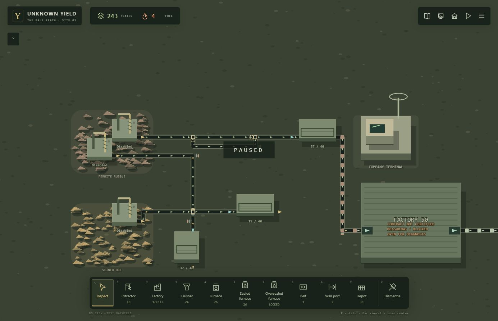

# Phase 6 integrated exit review

Recorded 2026-10-02. [PR #89](https://github.com/MohamedXIV/unknown-yield/pull/89), closing #84 and #80 after merge. Verified implementation/test SHA: ba36f2bcd660458476c544d5836b5dbcaf9d35b4. Production apps/packages code is unchanged from #83 merge 4330f913a736533d2d3128eec4c2f4f84e4d0841; this gate adds a domain regression and evidence, not new gameplay semantics.

## Domain integration

`packages/sim-core/test/phase6-exit.test.ts` constructs a productive crusher factory with internal T splitter/merger paths, a separate ferrite/veined-ore crossing, physical depots and terminal delivery using normal commands. Actual extraction and processing supply all cargo.

- Missing south outlet produces held ferrite and a pending horizontal signal. Sources are suspended, the loaded upgrade refuses conversion atomically, then the outlet is connected.
- A restored simulation equals the original complete serialized state on every one of 220 subsequent 100ms updates. The material ledger reconciles during blockage, recovery and final reclaim.
- Both depots contain only their intended material; structural plates are produced; discarded flow is empty; the same processor still belongs to the same factory.
- Blueprint v2 parses and excludes runtime cursor state. Undiscovered granules remain absent from the player snapshot.
- Removing the drained crossing refunds exactly the authored 12-plate upgrade.

Existing T, crossing, blueprint and throughput suites provide the precise contention fairness, old-save migrations, invalid-load atomicity, topology compatibility and scheduling-aware certification gates. Phase 5 exit tests and the full baseline verify authoritative discovery, exchange, obligations, recovery and terminal handling; this review does not claim to repeat every Phase 5 browser experiment.

## Verification

All exit 0 on the verified SHA:

- Focused: 6 files / 36 tests (integrated exit, T junctions, crossing, factory throughput, blueprint, Phase 5 exit).
- Full: 35 files / 241 tests.
- `npm run typecheck`, `npm run lint`, `npm run build`: PASS.
- Static export verification: PASS; no Studio route or authoring component.
- `git diff --check`: PASS.
- Normal-controls browser at http://127.0.0.1:3030/: PASS. Console warn/error entries after final SHA reload: `[]`.

## Persistent playable world

Loaded the previously saved #83 world normally, retaining its T split/merge routes, two material depots, ordinary turns/diverters and existing sources. No runtime/save injection or debug seed was used. Extended that same world with Factory 50 (38,33, 8x8), Crusher M51 (41,36), east-facing wall ports at (38,37)/(45,37), output Depot S70 (49,36), and a belt from the existing ferrite depot into the factory.

- An occupied south-facing feed corner (36,37) was given an active east manual exit. The route changed visibly and fed the factory without reclaiming its cargo or rebuilding the T network.
- Used the normal company assistance button when fuel was depleted: +36 fuel and 36 obligation, with recovery restrictions displayed. No authored unknown reaction was disclosed.
- Suspended extraction and crusher operation. Save/load retained Factory 50, M51, the enabled flag, active processing, 12 ferrite input and 2 plates output. Re-enabled the same crusher.
- Blocked the crossing's south outlet by switching its existing belt (24,36) west toward an unconnected cell. Resumed the ferrite feeder until the center held ferrite on Vertical, remaining 0, pending Horizontal, held route south. Loaded removal refused with “Empty the junction through belts first.”
- Saved and loaded that blocked pending state; the same cargo, counter and held route returned. Suspended the feeder, restored the outlet's main south exit and resumed. The center cleared; Depot S46 increased from 28 to 37 ferrite only. Depot S45 retained 15 veined ore only.
- Output Depot S70 reached 40 structural plates. Full physical output storage produces backpressure; Factory 50 correctly remains un-certified/measuring or blocked. This finite, fuel-limited browser run is not evidence of sustained throughput certification. The domain throughput suite supplies that evidence without weakening its stability policy.
- With the crossing empty, removed and restored its upgrade: construction stock 243 → 255 → 243, exactly 12 plates in each direction.
- Final save/reload on the verified SHA retained the factory, T routes, crossing, inventories, 243 plates and 4 fuel. World is saved and paused. Factory roof is presentation-only and can be reopened for diagnosis.

## Evidence and limits

[Restored factory buffers](evidence/phase6-exit-restored-factory.png), [blocked pending crossing](evidence/phase6-exit-pending.png), [recovered ferrite destination](evidence/phase6-exit-recovered.png), [physical plate output](evidence/phase6-exit-output.png).

Precise T fairness and save/load contention are domain assertions; the browser continues the earlier accepted loaded T world and observes its actual production path. Earlier feature-specific visual/compatibility evidence remains in PHASE6_BELT_ACCEPTANCE.md, PHASE6_T_ACCEPTANCE.md and PHASE6_CROSSING_ACCEPTANCE.md with its own historical SHA attribution.

No production defect was found, no persisted schema changed (13), and no gameplay or performance policy was amended. Underground transport and other deferred logistics remain deferred. Phase 7 has not been decomposed or implemented: the next planning gate must start with measured benchmark scenarios and budgets, not speculative optimization.
