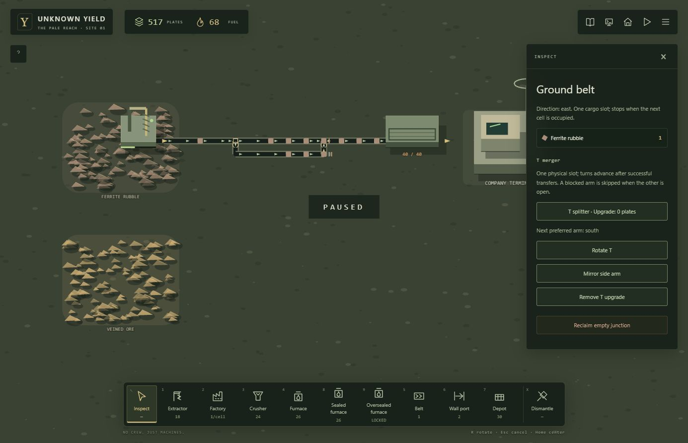

# Phase 6 / #82 — T junction acceptance

Recorded 2026-10-01. Implementation: `d244e9871a29d07858618ac44ff634c7a0de0e6a`. PR: [#87](https://github.com/MohamedXIV/unknown-yield/pull/87). Contract: [PHASE6_JUNCTIONS.md](PHASE6_JUNCTIONS.md), D-033. This accepts #82 only; #83 and the integrated #84 gate remain pending.

## Implemented behavior

An existing empty ground belt can be upgraded to an authored T splitter or merger. `direction` is the primary outlet; `branch` selects the perpendicular side. Ordered arms rotate together. Splitters have one inlet/two outlets; mergers have two inlets/one outlet. Their existing belt cargo slot is the sole central physical buffer.

The persisted cursor initially prefers arm 0, advances after a successful dispatch/admission, and then prefers the other arm. Unavailable candidates are skipped. A denied splitter reservation retries its other eligible outlet. Merger arbitration includes belt, machine and storage arrivals. Previous occupancy prevents entering and leaving the center in one update; destination reservations prevent double admission. Fully blocked junctions retain both cargo and cursor.

Configuration, role changes, rotation and removal require an empty slot. Factory walls/ports reject junctions. Costs/refunds and the construction ledger include the authored upgrade cost; fixture splitter/merger upgrades each cost 8 plates provisionally. Ordinary manual diverters remain manual. Ordinary depot forwarding keeps its previous order.

The inspector exposes role conversion, rotation, mirroring, removal and preferred-arm text. Phaser projects directed arms, inward/outward arrows, a preferred-arm ring, missing connections and blocked outputs from snapshots. These visuals do not own routing or inventory.

## Compatibility and monitor integration

- Save schema 12 reads schemas 4–11 through the existing migrations. The 11→12 step preserves ordinary belts/diverters/cargo/IDs/company state and adds no automatic T upgrades. Junction geometry, definition IDs and cursor 0/1 are validated before live state replacement. Junction state in an older schema is rejected.
- `junctions` is additive authored content, defaulting to `[]` in legacy bundles. Definitions have stable IDs, kind, localization key and positive cost. Content version remains `world-01-v6`; Studio preserves junction definitions as base content without adding another workbench subsystem.
- Factory blueprints retain v1 for layouts without T topology and emit v2 when an internal T exists. V2 has nullable junction topology per belt; cargo/cursor are excluded. Invalid definitions, branch values, wall placement, manual-alternate coexistence and runtime fields are rejected.
- Throughput graph traversal covers both configured splitter exits and valid T inlet connections. Topology signatures include definition/branch; recurrence signatures include cursor and physical cargo. Tests prevent a changed cursor from falsely certifying a one-tick cycle.

## Verification

All final commands exited 0:

- Focused transport/content/blueprint/throughput/presentation run: **7 files / 80 tests PASS**.
- Localization boundary regression: **1 file / 5 tests PASS**. It compares actual string values so a translated `east` cannot be mistaken for the stable ID `east-veins`.
- `npm test -- --maxWorkers 4`: **33 files / 225 tests PASS**.
- `npm run typecheck`, `npm run lint`, `npm run build`: **PASS**. Production static export contains no Studio route or authoring component.

Domain tests cover every rotation/branch, directed inlet rejection, reservations, unavailable-arm skips, atomic refusal/refunds and invalid saves. Continuously ready machine/storage versus belt inputs each receive 10 of 20 admissions. Restore from a non-initial cursor and held cargo matches the uninterrupted future trace. A real extractor→processor line with split and merge reconciles extraction, transformation, buffers, transit and terminal stock, certifies throughput and re-certifies identically after load. Existing company/discovery/conservation regressions pass. There is no remote CI workflow; these are local verification results.

## Normal-controls browser acceptance

At `http://127.0.0.1:3030/`, a fresh world was built using toolbar, inspector, drag and menu controls; no game-state/save injection was used.

1. Place an extractor at 18,26 and input belts to a splitter at 24,27. Upgrade a second cell at 29,27 to a merger. Rotation/mirroring change the entire visible T configuration; restore the east primary/south side configuration.
2. Run with two one-cell outlet stubs. Both stubs and the splitter fill; upstream cargo waits. Loaded rotation and reclaim return the localized empty-first refusal, retaining cargo and stock.
3. Save/load the blocked splitter. Its held ferrite, preferred east arm, 558 plates and 105 fuel survive.
4. Extend only the south branch into the merger and a physical Depot at 33,26. The east stub stays blocked; the open route delivers **24 ferrite** to storage.
5. Connect the east branch too. Both visible routes converge at the merger; its preferred inlet changes from west to south. When the Depot reaches 40/40, cargo remains in the merger and upstream routes. Save/load under this contention preserves the held item, preferred south arm, 517 plates and 68 fuel.
6. On a spare empty belt, upgrade/remove/reclaim changes stock **517→516→508→516→517**, refunding exactly the upgrade and base construction costs. The accepted route is left paused.

Browser console warning/error capture: **`[]`**.

## Next gate

#83 is the next dependency: the documented two-route controlled `+`, with simulation-step admission windows and center clearance. It is not implemented by #82. #84 must still prove the complete continuous-world Phase 6 path. Underground transport remains deferred.
