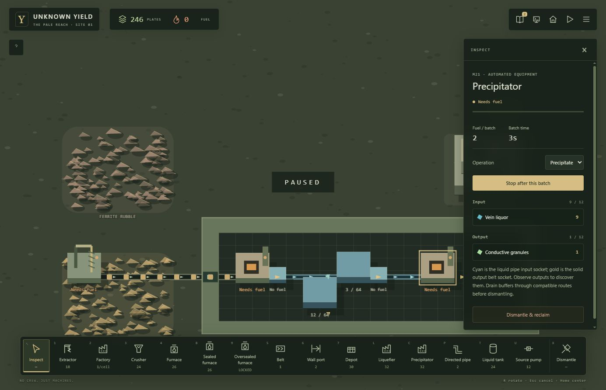
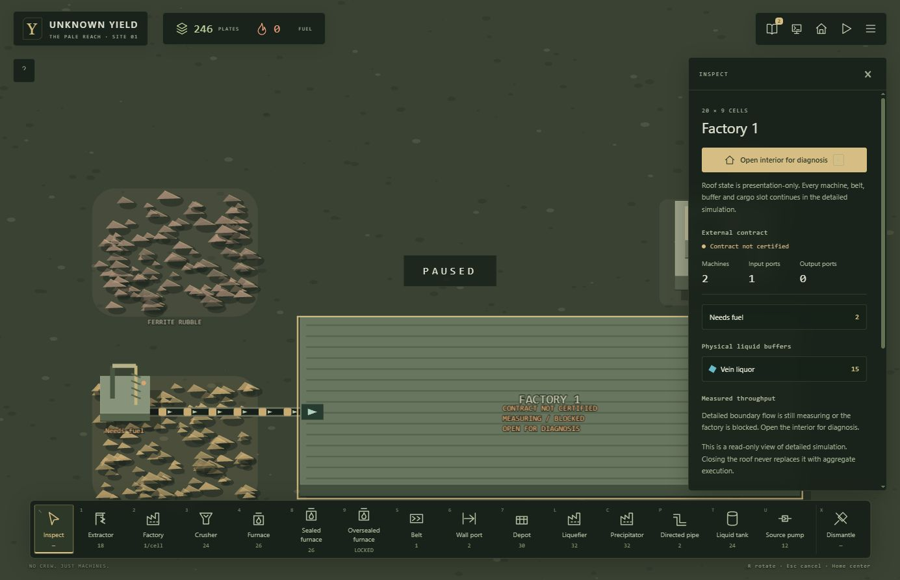

# Phase 9 liquid logistics acceptance — #108

Accepted scope: the first conservative solid → liquid → solid path, under epic #100. This does not complete Phase 9. Gas/pressure is #109; specialized containment #110; compatible terminal modules/export #111; broader recovery #112; integrated exit gate #113.

## Runtime contract

- Pure sim-core owns integer quantities in directed pipe cells, single-material tanks, machine buffers and jobs. Source pumps admit from an output socket into the next compatible pipe, charging authored fuel only on successful transfer.
- Pre-step source/destination reservations prevent same-update multihop and overfill. Disabled/no-fuel/blocked pumps stop admission; already admitted pipe contents can drain.
- Loaded pipe/tank edits and reclaim refuse atomically. Recovery requires a real compatible destination; there is no discard, spill or teleport fallback.
- Ordinary belts, dry storage/stock/staging reject liquids. The dry terminal leaves a liquid batch upstream with no export. Full terminal liquid handling remains #111.
- Factory recurrence includes connected liquid geometry, settings and quantities. Changing connected backlog prevents certification and removes an existing certificate until recurrence is earned again; unrelated reservoirs do not couple factories.
- Blueprint schema 3 exports relative pipe/tank/pump layout and pump settings, never contents. Existing v1/v2 layouts remain unchanged. There is no new stamping subsystem.
- Save schema 14 and fixture world-01-v7 are independent versions. Cheap schema-only migration adds empty liquid records; older content versions are explicitly incompatible and load rejection preserves the running expedition. Browser save slot v8 preserves previous slots.
- New authored liquid-0 is discovered by observed output from a dedicated liquefier operation; the dedicated precipitator converts it back to a solid. Existing recipe outcomes remain unchanged. Names and balance are provisional content, not permanent global rules.
- Content Studio roundtrip preserves handling states and machine interfaces.

## Verification

Final runtime source commit: `609c9fd93d5a41f4fb5e646c8903df5374a88dca`.

- Full integration gate: npm test -- --maxWorkers=4; npm run typecheck; npm run lint; npm run build; git diff --check. PASS: 41 test files, 281 tests passed, 2 skipped; typecheck, lint, build and whitespace checks passed. Browser console error/warn: `[]`.
- Domain normal-command chain checks conservation after every simulation update, observed discovery, detached snapshots and uninterrupted-versus-restored future equality.
- Focused tests cover full outlets, no-fuel/disabled pumps, existing liquid drainage, identity mismatch, insertion order, atomic construction/refund, loaded edit/removal refusal, dry-location save rejection and dry-terminal refusal.
- Blueprint tests cover relative layout/settings, quantity exclusion and overlap rejection; throughput tests cover connected backlog, unrelated reservoirs, topology changes and certificate withdrawal when backlog changes again.
- Initial gate exposed inherited-ID and stale fixture-version regressions; these were repaired. Studio roundtrip and certificate-withdrawal regressions were observed failing before repair.
- Native self-review used the approved design/plan and live #108; execution stayed in the same checkout without agents/worktrees or new dependencies.

## Normal-controls browser acceptance (2026-10-02)

At http://127.0.0.1:3030/, constructed with toolbar and mouse, without injected runtime state:

1. A fresh expedition built a 20×9 factory at (23,32), a matching input port, raw extractor, solid feed belts, liquefier, source pump, three directed pipes, primary tank, second pump, two pipes and precipitator.
2. Stopping the tank-output pump allowed physical buffering; a preliminary run displayed 30/64 liquid in the tank after discovery.
3. In the final expedition, an empty feed pipe was bent toward a missing endpoint. It filled to 4/4, upstream backpressure retained material, and reroute/reclaim controls became unavailable.
4. Disabled source feed and placed a south-facing recovery tank at (29,37). Already admitted liquid drained into it while the source pump stayed disabled. The pipe became 0/4 and editable; its outlet was restored east.
5. Enabled both pumps and resumed. The precipitator produced Conductive granules; the knowledge indicator reached two observed results. Fuel exhaustion stopped new work while preserving physical buffers.
6. Saved the expedition through Save world, reloaded the page, paused and used Load saved world. The UI confirmed Site restored, with 246 plates, 0 fuel, both discoveries, primary tank 3/64, recovery tank 12/64, precipitator input 9 liquid and output 1 granule.
7. Closed-factory inspection showed 15 liquid in physical logistics buffers and a truthful uncertified/blocked contract. Reopening restored the detailed view and correct liquid-input/solid-output socket instructions.
8. Console error/warn logs: [].

Browser checkpoints establish visible behavior; exact conservation and future equality are independently asserted by domain tests rather than inferred from screenshots.

The acceptance expedition remains saved in the new browser slot. Provisional fuel/balance, no pressure simulation, and terminal liquid export awaiting #111 are intentional limits.
